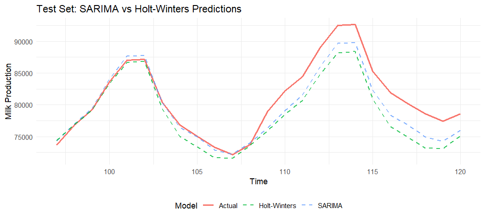
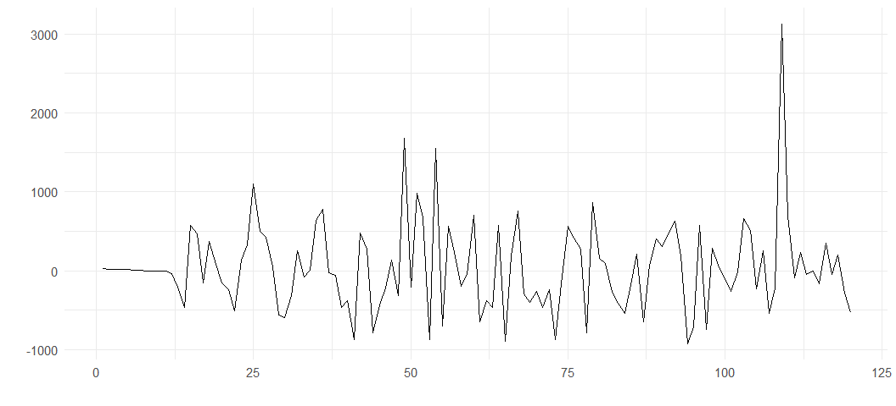
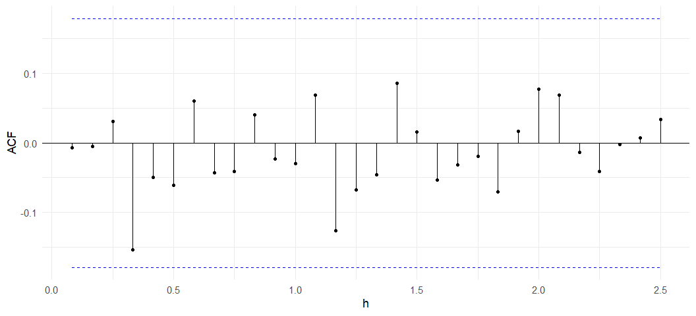
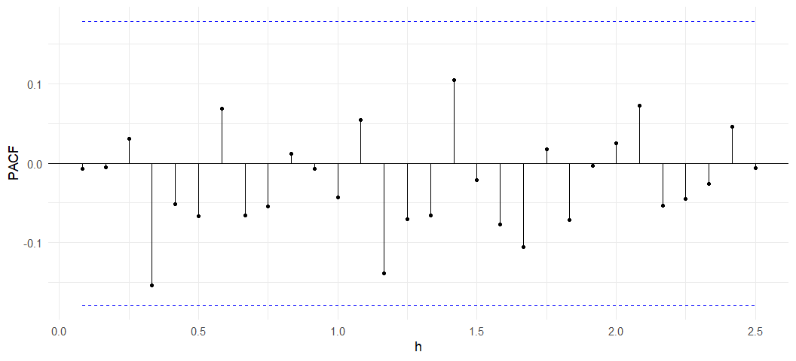

---
editor_options:
  markdown:
    wrap: 72
output: pdf_document
---

# Reporte

## Limpieza de datos.

Los datos no presentan outliers ni requieren preprocesamiento adicional,
por lo que se utilizaron los datos crudos.

## Visualización de la serie de tiempo

Se observa una tendencia creciente y un patrón estacional claro en los
datos. Esto sugiere una empresa cuya producción va incrementándose con
ciclos anuales, típicos de la industria. La serie no es estacionaria en
su forma original.

Aplicando la transformación:

$$Y_t = (1-B)(1-B^{12})X_t $$

se obtiene una serie estacionaria, como se aprecia en la **Figura 2**:

## Exploración de modelos.

De acuerdo a la transformación anterior, el espacio de modelos será el
$SARIMA(p, d=1, q)x(1, 1, 1)_{12}$ También exploraremos el modelo
Holt-Winters como una alternativa complementaria.

### Ajuste de modelos.

Ajustamos varios modelos SARIMA, variando las $p,q$ en un rango
razonable, y para todos los casos obtenemos residuales que no están
autocorrelacionados, Ljung-Box no rechaza H0 y sus predicciones se ven
razonables. Sin criterios adicionales, no hay razón a priori para
preferir un modelo sobre otro.

A continuación se muestran los residuales de los modelos evaluados
(**Figura 3-5**):

### Selección del modelo.

Para seleccionar el modelo óptimo, utilizamos el criterio de
minimización de la raíz del error cuadrático medio (RMSE) evaluada en un
conjunto de prueba que corresponde al 20% final de la serie temporal,
habiendo entrenado cada modelo con el 80% inicial.

Este criterio es más pragmático que el AIC, ya que permite comparar
modelos de naturaleza distinta y proporciona una estimación más directa
del desempeño predictivo futuro.

| Modelo       | p   | q   | RMSE     | AIC      |
| ------------ | --- | --- | -------- | -------- |
| SARIMA 1     | 1   | 1   | 2142.196 | 1299.884 |
| SARIMA 2     | 2   | 1   | 2145.579 | 1301.842 |
| SARIMA 3     | 1   | 2   | 2145.579 | 1301.84  |
| SARIMA 4     | 2   | 2   | 2187.612 | 1298.838 |
| Holt-Winters | \-  | \-  | 3144.533 | \-       |

El modelo SARIMA(1,1,1)(1,1,1)12 minimizó el RMSE, por lo que fue
seleccionado para el análisis posterior.

La siguiente gráfica muestra la comparación entre las predicciones de
los modelos SARIMA y Holt-Winters frente a los datos reales (**Figura
6**):

### Validación del modelo.

Una vez elegido el modelo SARIMA(1,1,1)(1,1,1)12 hay que re-entrenarlo
en el 100% de los datos para hacer las predicciones finales.

Las siguientes gráficas muestran los residuales del modelo (**Figura
7**); el ACF de los residuales (**Figura 8**); y el PACF de los
residuales (**Figura 9**):

Los residuales presentan un comportamiento adecuado, permaneciendo
dentro de las bandas de confianza. La prueba Ljung-Box no rechaza $H_0$
con un $p\text{-value} = 0.9488$, confirmando que los residuales no
presentan autocorrelación. Por tanto, el modelo es válido para realizar
predicciones.

### Predicción a 1 año.

Según el modelo, la producción proyectada de la empresa dentro de 12
meses será de **81,855 galones de leche**.

### Riesgo de la predicción.

Como consultora, es fundamental comunicar al cliente no solo la
predicción puntual, sino también una medida de incertidumbre asociada.

Para nuestro caso, las bandas de confianza son pequeña, para 12 meses
tenemos un intervalo de $\pm$ $3629$ galones alrededor de la media
(el intervalo de confianza es ($78225,85484$) ). Hay un 95% de
probabilidad de que no se cumpla la predicción que se está dando, 2.5%
que esté arriba y 2.5% que esté abajo (caso desfavorable.)

### Conclusiones

El dataset utilizado es relativamente simple y no presenta outliers ni
volatilidad significativa, lo que permitió identificar un modelo de
fácil interpretación y con predicciones confiables.

La empresa exhibe una tendencia clara de crecimiento. El modelo SARIMA
seleccionado captura adecuadamente esta dinámica, permitiendo estimar
las ventas futuras de forma razonable y proporcionar al cliente una
medida cuantificable del riesgo asociado a la predicción.
